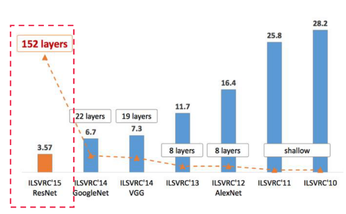
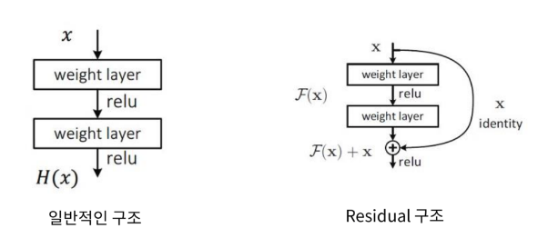
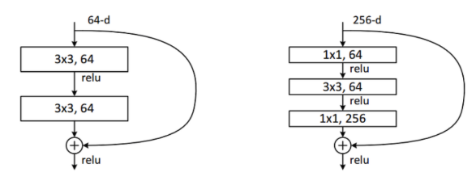
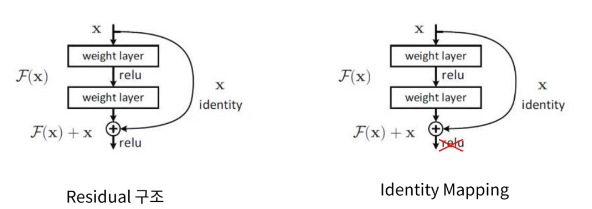
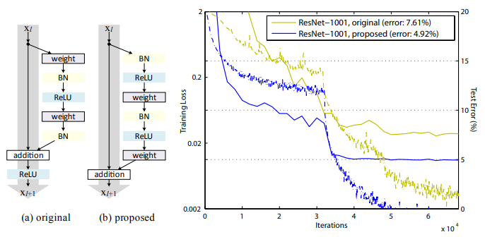
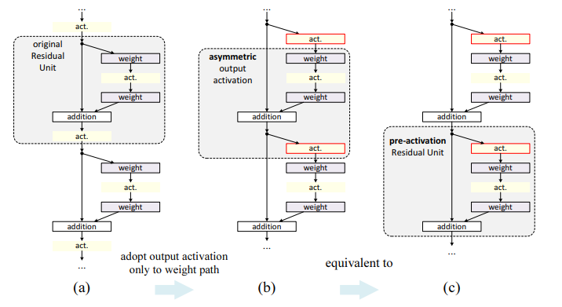

# Deep Residual Learning for Image Recognition

This repository is for practicing to implement computer vision network architecture one by one from scratch and the architecture is **resnet** which is one of the most representative architectures in computer vision.

## Resnet의 성과

위의 그래프에서 알 수 있듯이, 15년도에 출현한 **resnet** 은 과거의 알고리즘보다 layer의 수를 급격히 늘리면서 최고의 성능을 달성하였다. 그리고 이러한 결과에 대해서는 **resnet**이 다음과 같은 문제점을 해결했다는 것을 알 수 있다.

* layer의 수를 늘리면 성능이 좋아진다는 개념의 연구 경향이 있었지만, 무작정 layer의 수를 늘리기에는 overfitting과 vanishing gradient의 문제가 발생한다는 점에서 한게가 존재하였다. 

## Resnet 구조

**resnet**이 신경망을 깊게 함에도 불구하고, vanishing gradient를 방지할 수 있었던 것은 **skip connection**이라는 기법을 사용했기 때문이다. 

위의 그리과 같이 일반적인 구조에서는 단순히 입력된 이미지는 CNN과 activation을 통과하고, 이러한 구조가 지속적으로 연결된다. 하지만, Residual 구조에서는 입력 $x$가 skip connection으로 해당 구조의 마지막 출력에 그대로 더해지는 연산이 수행된다. (이를 **Identity**이라고 부르기도 한다.) 즉, 입력의 feature를 추출 하기 전과 후를 더한 것이라고 볼 수 있다. 

이를 통해서 **resnet**은 입력의 더 작은 fluctuation에도 민감하게 반응할 수 있기 때문에 신경망이 깊어질 수 있다고 한다. 

> 이는 입력을 그대로 더하는 연산은 backpropagation에서 미분값이 1이 되어 영향을 그대로 유지할 수 있기 때문이라고 생각한다. 그리고 이는 초기 입력의 특징을 그대로 전달하는 효과를 얻기 때문에 `GoogleNet`처럼 보조 레이어가 필요하지 않는다는 장점이 있다고 생각한다.

이를 통해서 신경망이 깊어지는 데에 문제점이 되었던 vanishing gradient를 어느 정도 해결했다고 볼 수 있어서 본 논문은 신경망을 깊게 할수록 성능이 좋아진다는 study도 포함하고 있다.

#### Bottleneck 

이는 **resnet**의 bottleneck netowrk의 구조로서 오쪽에서처럼 구조를 설계함으로서 연산량을 줄여주면서 성능을 개선하는 효과를 얻었다.

#### Identity mapping

앞서 설명한 초기의 **resnet**은 다음과 같이 네트워크 구조를 변경함으로서 개선되었다.

일반적으로 입력 이미지에 대한 feature를 추출하기 위해서는 `weight -> BN -> activation(ReLU)`의 순서를 거친다. 하지만, 오른쪽처럼 **Identity Mapping**처럼 activation의 위치를 조정함으로서 성능을 개선시킨다. 

(b)의 proposed는 **pre-activation**이라는 기법으로 `BN → ReLU → weight → BN → ReLU → weight`의 순서를 거친다. 결과적으로 성능이 개선되었고, 이는 기존의 구조와 다음과 같은 차이를 가진다. 

`Conv - BN - ReLU` 에서 `BN - ReLU - Conv` 구조로 변경한 것만으로 성능이 개선되었고, 후자에서는 skip connection에 어떤 추가 연산도 없이 말 그대로 Gradient Highway가 형성되어 극적인 효과를 얻게 되었다.

논문에서는 이러한 구조를 적용한 것이 **asymmetric**과 **pre-activation** 효과를 주기 위해서라고 한다. 위 그림의 가장 왼쪽의 기존 Residual 구조이고 가운데 또는 오른쪽 그림 (두 개는 같지만 시점이다.)은 Pre-Activation 구조이다. 먼저 가운데 그림 시점에서 **Pre-Activation**을 보면 기존의 Residual 구조에 비해 비대칭적인 구조를 적용할 수 있어 네트워크에 다양성을 부과할 수 있고, 오른쪽 그림 시점에서 보면 Activation function을 먼저 적용해 봄으로써 새로운 효과를 주어봤고 실제 성능이 좋았다고 한다.

## References

* [Deep Residual Learning for Image Recognition](https://arxiv.org/pdf/1512.03385.pdf)
* [Identity Mappings in Deep Residual Networks](https://arxiv.org/pdf/1603.05027.pdf)